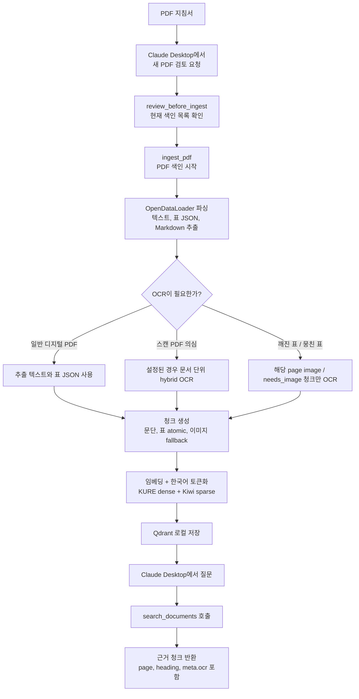

# RAG MCP

회계·예산 지침서 PDF를 로컬에서 색인하고, **Claude Desktop에서 질문으로 검색**할 수 있게 해 주는 MCP 서버입니다.

터미널에서 계속 명령어를 치는 도구가 아닙니다. 처음 한 번 설치하고 Claude Desktop에 연결해 두면, 이후에는 Claude Desktop에서 “2026년 예산 지침에서 일상경비 한도를 찾아줘”처럼 말로 요청해서 사용합니다.

OCR은 전체 PDF에 무조건 돌지 않습니다. 기본값에서는 스캔 PDF이거나 깨진 표처럼 텍스트 추출이 부족한 구간에서만 보강합니다.

## 전체 워크플로



## 설치 순서

아래 순서대로 한 번만 진행하면 됩니다. 설치와 연결은 터미널을 잠깐 쓰지만, 실제 사용은 Claude Desktop에서 합니다.

### 1. 준비물

| 프로그램 | 용도 |
|---|---|
| Python 3.11 | 프로젝트 실행용 Python |
| uv | Python 의존성 설치와 실행 |
| Git | GitHub 저장소 다운로드 |
| Claude Desktop | 실제로 질문하고 MCP 도구를 호출하는 앱 |

이 프로젝트는 Python 3.11 기준입니다. Python 3.13은 torch 계열 의존성 설치 문제가 생길 수 있어 권장하지 않습니다.

### 2. 프로젝트 다운로드

원하는 폴더에서 아래 명령을 실행합니다.

```bash
git clone https://github.com/jang-hoil/rag-mcp.git "RAG MCP"
cd "RAG MCP"
```

이미 이 저장소를 받아 둔 상태라면 프로젝트 폴더로 이동만 하면 됩니다.

```bash
cd "C:\Users\Owner\Desktop\RAG MCP"
```

### 3. Python 패키지 설치

```bash
uv sync
```

설치가 끝났는지 확인합니다.

```bash
uv run rag-mcp status
```

처음 실행할 때 KURE-v1 임베딩 모델이 HuggingFace에서 자동 다운로드될 수 있습니다. 한 번 받아지면 `~/.cache/huggingface`에 캐시됩니다.

### 4. OCR이 필요하면 추가 설치

디지털 PDF만 쓸 거라면 이 단계는 건너뛰어도 됩니다. 스캔 PDF나 깨진 표 구간까지 보강하려면 설치합니다.

```bash
uv sync --extra ocr
winget install --id UB-Mannheim.TesseractOCR
uv run rag-mcp doctor
```

`doctor` 결과에서 Tesseract 실행파일과 `kor`, `eng` 언어팩이 정상으로 나오면 OCR 준비가 끝난 것입니다.

## Claude Desktop에 연결하기

Claude Desktop은 MCP 서버를 설정 파일에 등록한 뒤 재시작해야 도구를 인식합니다.

### 1. 설정 파일 열기

Claude Desktop에서 아래 순서로 들어갑니다.

```text
Claude Desktop 실행
Settings 열기
Developer 메뉴 선택
Edit Config 클릭
```

그러면 보통 아래 파일이 열립니다.

```text
%APPDATA%\Claude\claude_desktop_config.json
```

직접 열고 싶다면 Windows 실행창이나 파일 탐색기 주소창에 위 경로를 넣어도 됩니다.

### 2. 설정 파일 작성

아래 형태로 작성합니다. **굵게 표시한 두 경로는 사람마다 다르므로 본인 PC 값으로 바꿔야 합니다.** (바꾸는 방법은 바로 아래 4번에서 설명합니다.)

```json
{
  "mcpServers": {
    "rag-mcp": {
      "command": "<여기에 uv.exe 경로>",
      "args": [
        "--directory",
        "<여기에 이 프로젝트 폴더 경로>",
        "run",
        "rag-mcp",
        "serve"
      ]
    }
  }
}
```

참고로, 이 저장소가 `C:\Users\Owner\Desktop\RAG MCP`에 있는 한 대의 PC에서는 실제로 아래처럼 채워집니다(어디까지나 **예시**입니다 — 본인 경로로 바꾸세요).

```json
{
  "mcpServers": {
    "rag-mcp": {
      "command": "C:\\Users\\Owner\\AppData\\Local\\Programs\\Python\\Python313\\Scripts\\uv.exe",
      "args": [
        "--directory",
        "C:\\Users\\Owner\\Desktop\\RAG MCP",
        "run",
        "rag-mcp",
        "serve"
      ]
    }
  }
}
```

> 위 예시 경로의 `Python313`은 단지 `uv.exe`가 설치된 위치일 뿐이며, 이 프로젝트가 실행에 쓰는 Python(3.11)과는 무관합니다. `uv`가 알아서 3.11 가상환경을 사용하므로 신경 쓰지 않아도 됩니다.

이미 다른 MCP 서버가 등록되어 있다면 전체 파일을 덮어쓰지 말고, `mcpServers` 안에 `rag-mcp` 항목만 추가합니다.

예시:

```json
{
  "mcpServers": {
    "existing-server": {
      "command": "...",
      "args": []
    },
    "rag-mcp": {
      "command": "C:\\Users\\Owner\\AppData\\Local\\Programs\\Python\\Python313\\Scripts\\uv.exe",
      "args": [
        "--directory",
        "C:\\Users\\Owner\\Desktop\\RAG MCP",
        "run",
        "rag-mcp",
        "serve"
      ]
    }
  }
}
```

### 3. 이 설정이 뜻하는 것

| 항목 | 쉬운 설명 |
|---|---|
| `rag-mcp` | Claude Desktop에 표시될 서버 이름 |
| `command` | RAG MCP를 실행할 `uv.exe` 위치 |
| `--directory` | 서버를 **이 프로젝트 폴더에서 실행**하라는 뜻. 색인 결과가 저장되는 `data\` 폴더도 여기에 생긴다 |
| `run rag-mcp serve` | MCP 서버를 켜라는 뜻 |

> **`--directory`가 색인 데이터(`data\`)의 위치를 정합니다.**
> 색인 결과는 PDF를 어디에 두었는지와 **상관없이** 항상 `--directory`로 지정한 프로젝트 폴더 안 `data\`에 생깁니다(PDF 경로는 "읽어올 원본 주소"일 뿐입니다).
> 엉뚱한 폴더를 적으면 색인이 거기 쌓여 "사라진 것처럼" 보이니, 반드시 이 프로젝트를 풀어둔 폴더를 적으세요.
> 무엇이 어디에 생기는지는 아래 [운영 주의사항](#운영-주의사항)을 참고하세요.

“stdio transport”는 사용자가 서버 창을 따로 켜 두는 방식이 아닙니다. Claude Desktop이 필요할 때 위 명령을 뒤에서 실행하고, Claude Desktop과 RAG MCP가 표준입출력으로 통신한다는 뜻입니다.

### 4. 내 PC 경로가 다르면 바꿀 곳

설정에서 바꿔야 하는 경로는 보통 2개입니다.

| 바꿀 값 | 무엇인지 |
|---|---|
| `command` | `uv.exe`가 설치된 위치 |
| `--directory` 다음 값 | 이 프로젝트 폴더 위치 |

#### `uv.exe` 경로 확인

터미널이나 PowerShell에서 아래 명령을 실행합니다.

```bash
where uv
```

예를 들어 이렇게 나오면:

```text
C:\Users\Owner\AppData\Local\Programs\Python\Python313\Scripts\uv.exe
C:\Users\Owner\.local\bin\uv.exe
```

둘 중 하나를 골라 `command` 값에 넣으면 됩니다. 보통 첫 번째 줄을 쓰면 됩니다.

단, JSON에서는 `\`를 `\\`처럼 두 번 써야 합니다.

| 터미널에 나온 경로 | JSON에 적는 값 |
|---|---|
| `C:\Users\Owner\AppData\Local\Programs\Python\Python313\Scripts\uv.exe` | `C:\\Users\\Owner\\AppData\\Local\\Programs\\Python\\Python313\\Scripts\\uv.exe` |

#### 내 PC에 맞게 바꾸기

아래 예시에서 보통 2곳만 바꾸면 됩니다.

```json
{
  "mcpServers": {
    "rag-mcp": {
      "command": "C:\\Users\\Owner\\AppData\\Local\\Programs\\Python\\Python313\\Scripts\\uv.exe",
      "args": [
        "--directory",
        "C:\\Users\\Owner\\Desktop\\RAG MCP",
        "run",
        "rag-mcp",
        "serve"
      ]
    }
  }
}
```

| 바꿀 곳 | 넣을 값 |
|---|---|
| `command` | `where uv`에서 나온 `uv.exe` 경로 |
| `--directory` 다음 줄 | 이 프로젝트 폴더 경로 |

`command`에는 `uv.exe` 경로만 넣습니다. `uv run rag-mcp serve` 같은 실행 명령 전체를 넣지 않습니다. 실행 옵션은 `args`에 나눠 넣습니다.

헷갈리면 `/`를 써도 됩니다. JSON에서는 아래처럼 적어도 정상입니다.

```json
{
  "mcpServers": {
    "rag-mcp": {
      "command": "C:/Users/Owner/AppData/Local/Programs/Python/Python313/Scripts/uv.exe",
      "args": [
        "--directory",
        "C:/Users/Owner/Desktop/RAG MCP",
        "run",
        "rag-mcp",
        "serve"
      ]
    }
  }
}
```

흔한 실수:

- `command`에 `where uv`라고 적지 않습니다. `where uv`는 경로를 찾는 명령입니다.
- `command`에 명령 전체를 적지 않습니다. `uv.exe` 경로만 적습니다.
- `C:\Users\...`처럼 `\`를 한 번만 쓰면 JSON 오류가 날 수 있습니다. `C:\\Users\\...`처럼 두 번 씁니다.

### 5. Claude Desktop 재시작

설정 파일을 저장한 뒤 Claude Desktop을 완전히 종료하고 다시 실행합니다.

작업 표시줄에 남아 있으면 완전히 꺼지지 않은 상태일 수 있습니다. 가능하면 Claude Desktop 창을 모두 닫고 다시 실행하세요.

## Claude Desktop에서 실제 사용하기

### 연결 확인

Claude Desktop에서 이렇게 물어봅니다.

```text
연결된 RAG MCP 도구로 collection_status를 실행해서 상태를 확인해줘.
```

정상이라면 컬렉션 이름, 문서 수, sparse 사용 여부 같은 상태가 나옵니다.

### PDF를 새로 넣을 때

PDF 파일은 아무 폴더에 두어도 됩니다. 경로만 알려주면 되고, 색인 결과는 PDF 위치와 무관하게 프로젝트 폴더의 `data\`에 저장됩니다.

먼저 현재 색인 목록을 확인합니다.

```text
이 PDF를 색인하기 전에 review_before_ingest로 현재 색인 목록을 먼저 보여줘.
PDF 경로는 C:\문서\2026_예산편성지침.pdf 이야.
```

목록을 보고 구버전을 삭제할지 판단한 뒤 색인을 시작합니다.

```text
이 PDF를 fiscal_year 2026으로 ingest_pdf 해줘.
진행 상태는 ingest_status로 확인해줘.
```

큰 PDF는 시간이 걸릴 수 있습니다. `ingest_pdf`는 바로 `job_id`를 반환하고, 실제 색인은 백그라운드에서 진행됩니다.

### 검색할 때

```text
2026년 예산 지침에서 일상경비 한도를 찾아줘.
근거 페이지와 청크 내용을 같이 보여줘.
```

또는:

```text
201-01 일반수용비 관련 규정을 검색해줘.
```

Claude Desktop은 내부적으로 `search_documents` 도구를 호출해 결과를 가져옵니다.

### 문서를 삭제할 때

삭제는 실수 방지를 위해 확인값이 필요합니다.

```text
list_documents로 색인된 문서를 보여줘.
그중 오래된 2025 예산편성지침 문서를 delete_document로 삭제해줘. confirm=True로 실행해.
```

## MCP 도구 목록

| 도구 | Claude Desktop에서 쓰는 상황 |
|---|---|
| `collection_status` | 연결 상태, 컬렉션 상태 확인 |
| `review_before_ingest` | 새 PDF 넣기 전 기존 색인 목록 확인 |
| `ingest_pdf` | PDF 색인 시작 |
| `ingest_status` | PDF 색인 진행 상태 확인 |
| `search_documents` | 질문으로 지침 검색 |
| `list_documents` | 색인된 문서 목록 확인 |
| `get_chunk` | 특정 청크 원문 확인 |
| `delete_document` | 문서 삭제 |
| `reindex_document` | 기존 문서 재색인 |

## OCR 동작 방식

기본값은 `RAG_OCR=auto`입니다.

| 상황 | 동작 |
|---|---|
| 일반 디지털 PDF | OpenDataLoader가 추출한 텍스트와 표 JSON을 그대로 사용 |
| 스캔 PDF로 의심되는 문서 | `RAG_ODL_HYBRID`가 설정된 경우 문서 단위 hybrid OCR 후보 |
| 깨진 표, 뭉친 표, 이미지 fallback 청크 | 해당 페이지 이미지 또는 `needs_image=True` 청크만 Tesseract OCR |
| OCR을 쓰지 않으려는 경우 | `RAG_OCR=off` |
| 이미지 fallback 청크를 강제로 OCR하려는 경우 | `RAG_OCR=force` |

즉, “필요시 OCR”은 전체 PDF를 매번 OCR한다는 뜻이 아니라 **스캔 문서 또는 깨진 표처럼 텍스트 추출이 부족한 구간만 보강한다는 뜻**입니다. OCR 적용 여부와 skip 사유는 manifest와 검색 결과의 `meta.ocr`에 남습니다.

## 터미널 명령어 요약

Claude Desktop 중심으로 사용할 때는 자주 쓰지 않아도 되지만, 점검할 때 유용합니다.

| 목적 | 명령 |
|---|---|
| 기본 설치 | `uv sync` |
| OCR 포함 설치 | `uv sync --extra ocr` |
| 상태 확인 | `uv run rag-mcp status` |
| OCR 환경 진단 | `uv run rag-mcp doctor` |
| 테스트 | `uv run pytest -q` |
| 직접 서버 실행 점검 | `uv run rag-mcp serve` |

`uv run rag-mcp serve`는 점검용입니다. Claude Desktop에 연결해서 쓸 때는 사용자가 직접 켜 둘 필요가 없습니다.

서버는 기동 시 임베딩 모델을 미리 메모리에 올립니다(워밍업). 이때 콘솔(stderr)에 `임베딩 모델 로딩 시작 → 로딩 완료 → 워밍업 완료 — 검색 준비됨` 로그가 순서대로 뜹니다. 이 로그가 보인 뒤부터 첫 검색도 콜드 스타트 지연 없이 즉시 응답합니다(로딩에 약 10초 내외 소요).

## 환경 변수

필요하면 `.env.example`을 `.env`로 복사해 조정합니다. 별도 API 키는 필요 없습니다.

| 변수 | 기본값 | 설명 |
|---|---|---|
| `RAG_DATA_DIR` | `./data` | 색인 산출물, Qdrant, manifest 저장 루트 |
| `RAG_QDRANT_MODE` | `local` | `local` 또는 `server` |
| `RAG_QDRANT_PATH` | `./data/qdrant` | local 모드 저장 경로 |
| `RAG_QDRANT_URL` | 없음 | server 모드 Qdrant URL |
| `RAG_EMBEDDING_MODEL` | `kure` | `kure` 또는 `bge_m3` |
| `RAG_HF_OFFLINE` | `1` | `1`이면 임베딩 모델을 로컬 캐시에서만 로드(HF 네트워크 조회 차단). 정부망 등에서 검색이 멈추는 것을 막는다. 모델을 처음 받을 때만 `0`으로 두고 1회 다운로드 |
| `RAG_RENDER_DPI` | `200` | 표/페이지 이미지 렌더 DPI |
| `RAG_OCR` | `auto` | `off`, `auto`, `force` |
| `RAG_OCR_MIN_CHARS` | `30` | 스캔 PDF 판정 임계(페이지당 글자 수가 이 값 미만이면 빈약한 페이지) |
| `RAG_OCR_LANG` | `kor+eng` | Tesseract OCR 언어 |
| `RAG_ODL_HYBRID` | `off` | 스캔 PDF 문서 단위 hybrid OCR 사용 시 설정 (예: `hancom-ai`) |
| `RAG_ODL_HYBRID_URL` | 없음 | hybrid OCR 서버 URL (별도 기동 시) |

## 운영 주의사항

Qdrant local path 모드는 **동시에 하나의 프로세스만** 접근해야 합니다.

Claude Desktop에 MCP로 연결해 쓰는 동안에는 다른 터미널에서 `uv run rag-mcp ingest`를 실행하지 마세요. PDF 색인은 Claude Desktop에서 `ingest_pdf`로 요청하는 것이 안전합니다.

또한 Claude Desktop이 서버를 켜 둔 동안에는 실행파일(`rag-mcp.exe`)이 잠겨 있어 다른 터미널의 `uv run ...`(예: `uv run pytest`)이 *파일이 사용 중* 오류로 실패할 수 있습니다. 이때는 Claude Desktop을 잠시 종료하거나, 가상환경 파이썬으로 직접 실행하세요: `./.venv/Scripts/python.exe -m pytest -q`.

### 프로젝트 전체 구조 (참고)

소스코드(◆ git 포함)와 색인 시 생성되는 산출물(✦ git 제외)이 한 폴더 안에 함께 있습니다. 다른 사람이 `git clone`하면 **◆만** 받고, ✦는 본인 PC에서 새로 생성됩니다(그래서 색인 데이터는 복제되지 않습니다).

```text
RAG MCP\                          ← 프로젝트 루트(= --directory)
│
├─ src\rag_mcp\                   ◆ 소스코드 (25개 모듈)
│   ├─ server.py                   FastMCP 진입점(도구 등록)
│   ├─ service.py                  도구 7개 비즈니스 로직
│   ├─ pipeline.py, pdf_parser.py, chunking.py, table_chunking.py   파싱·청킹
│   ├─ embeddings.py, sparse.py, tokenizer.py                       임베딩·한국어 토큰화
│   ├─ retrieval.py, vector_store.py                                검색·Qdrant
│   ├─ ocr.py, ocr_triage.py, page_render.py                        OCR
│   ├─ indexer.py, manifest.py, jobs.py, metadata.py, models.py     색인·상태·데이터모델
│   └─ config.py, request_models.py, cli.py, doctor.py, evaluation.py
│
├─ tests\                         ◆ 테스트
├─ eval\                          ◆ 평가용 데이터·스크립트
├─ README.md, CLAUDE.md, PROGRESS.md, MCP_연동가이드.md, AGENTS.md   ◆ 문서
├─ pyproject.toml, .env.example, .gitignore, uv.lock                ◆ 설정
│
├─ data\                          ✦ 색인할 때 생성 (git 제외)
│   ├─ parsed\{문서}\              파싱 캐시: json·md·문서 내 이미지·페이지 PNG·chunks
│   ├─ qdrant\                    검색용 벡터 저장소(모든 문서 공용)
│   └─ manifests\{문서}.json      색인 목록·상태 원장(list_documents가 읽는 곳)
│
├─ .venv\                         ✦ Python 가상환경(설치 시 1회 생성)
└─ .pytest_cache\                 ✦ 테스트 캐시
```

여기에 더해, 임베딩 모델은 **프로젝트 폴더 밖**(사용자 홈)에 받아집니다.

```text
C:\Users\{사용자}\.cache\huggingface\   ← 임베딩 모델 KURE-v1(수 GB)
```

> **`data\`만 생기는 게 아닙니다.** 임베딩 모델(수 GB)은 프로젝트 폴더가 아니라 **사용자 홈의 HuggingFace 캐시**에 받아집니다. 모든 프로젝트가 공유하므로 `--directory`나 `data\`를 바꿔도 그대로 남고, 첫 색인 때 한 번만 다운로드됩니다. 그래서 용량 정리한다고 `data\`만 지워도 모델(수 GB)은 그대로 남습니다.

`data\`의 위치는 [환경 변수](#환경-변수)의 `RAG_DATA_DIR`로 바꿀 수 있습니다(절대경로를 넣으면 실행 위치와 무관하게 한곳에 고정).

커밋하지 않는 재생성 산출물:

- `data/qdrant/`, `data/parsed/`, `data/manifests/`
- `*.pdf`, `*.png`
- `.cache/`, `.venv/`, `__pycache__/`, `.pytest_cache/`
- `.env`

## 참고 문서

- [MCP 사용자 빠른 시작](https://modelcontextprotocol.io/quickstart/user)
- [MCP_연동가이드.md](./MCP_연동가이드.md)
