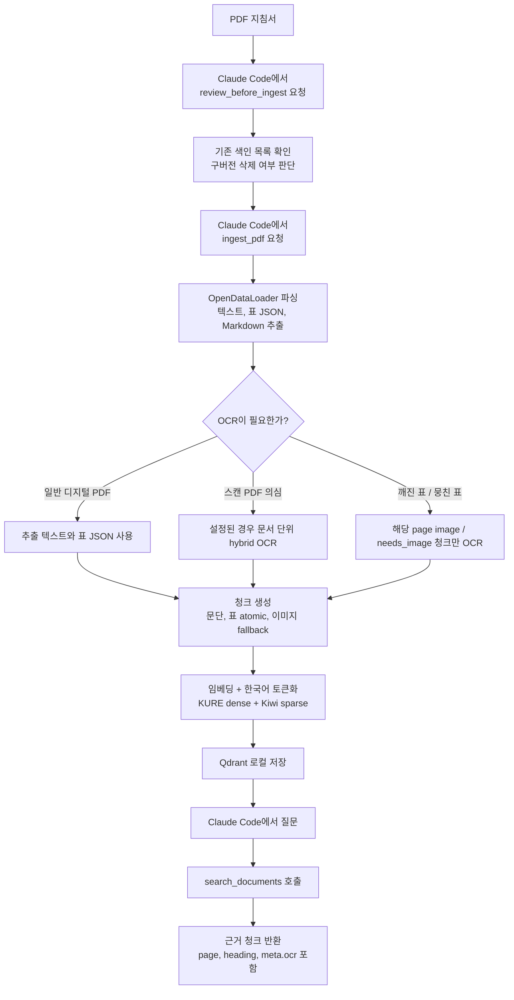

# RAG MCP

회계·예산 지침서 PDF를 로컬에서 색인하고, Claude Code에서 질문으로 검색할 수 있게 해 주는 MCP 서버입니다.

터미널에서 계속 명령어를 치는 도구라기보다, **처음 한 번 설치하고 Claude Code에 연결한 뒤 Claude Code에게 말로 사용하는 도구**라고 보면 됩니다. 예를 들면 Claude Code에 “2026년 예산 지침에서 일상경비 한도를 찾아줘”라고 요청하면, Claude Code가 이 MCP 서버의 검색 도구를 호출해 색인된 PDF에서 근거 청크를 찾아옵니다.

OCR은 전체 PDF에 무조건 돌지 않습니다. 기본값에서는 스캔 PDF이거나 깨진 표처럼 텍스트 추출이 부족한 구간에서만 보강합니다.

## 전체 워크플로



## 초보자 설치 순서

아래 순서대로 진행하면 됩니다. 터미널은 **설치와 Claude Code 연결할 때만** 사용하고, 이후 실제 검색/색인은 Claude Code에서 요청하면 됩니다.

### 1. 준비물

필요한 프로그램:

| 프로그램 | 용도 |
|---|---|
| Python 3.11 | 프로젝트 실행용 Python |
| uv | Python 의존성 설치와 실행 |
| Git | GitHub 저장소 다운로드 |
| Claude Code | 실제로 MCP 도구를 호출할 작업 환경 |

이 프로젝트는 Python 3.11 기준입니다. Python 3.13은 torch 계열 의존성 설치 문제가 생길 수 있어 권장하지 않습니다.

### 2. 프로젝트 다운로드

원하는 폴더에서 아래 명령을 실행합니다.

```bash
git clone https://github.com/jang-hoil/rag-mcp.git "RAG MCP"
cd "RAG MCP"
```

이미 이 저장소를 받아 둔 상태라면 `cd "RAG MCP"`만 하면 됩니다.

### 3. Python 패키지 설치

```bash
uv sync
```

설치가 끝났는지 확인합니다.

```bash
uv run rag-mcp status
```

처음 실행할 때 KURE-v1 임베딩 모델이 HuggingFace에서 자동 다운로드될 수 있습니다. 한 번 받아지면 `~/.cache/huggingface`에 캐시됩니다.

### 4. OCR이 필요하면 추가 설치

디지털 PDF만 쓸 거라면 이 단계는 건너뛰어도 됩니다. 스캔 PDF나 깨진 표 구간까지 보강하려면 설치합니다.

```bash
uv sync --extra ocr
winget install --id UB-Mannheim.TesseractOCR
uv run rag-mcp doctor
```

`doctor` 결과에서 Tesseract 실행파일과 `kor`, `eng` 언어팩이 정상으로 나오면 OCR 준비가 끝난 것입니다.

## Claude Code에 연결하기

여기가 가장 중요합니다. 이 프로젝트는 Claude Desktop보다 **Claude Code에서 쓰는 흐름**을 우선합니다.

### 1. 이 PC에서 바로 쓰는 등록 명령

이 저장소가 `C:\Users\Owner\Desktop\RAG MCP`에 있고, `uv.exe`가 아래 경로에 있다면 이 명령을 그대로 실행합니다.

```bash
claude mcp add rag-mcp -- "C:\Users\Owner\AppData\Local\Programs\Python\Python313\Scripts\uv.exe" --directory "C:\Users\Owner\Desktop\RAG MCP" run rag-mcp serve
```

이 명령의 뜻은 간단합니다.

| 부분 | 의미 |
|---|---|
| `claude mcp add rag-mcp` | Claude Code에 `rag-mcp`라는 MCP 서버를 등록 |
| `uv.exe` | 이 프로젝트를 실행할 프로그램 |
| `--directory "C:\Users\Owner\Desktop\RAG MCP"` | RAG MCP 프로젝트 폴더에서 실행하라는 뜻 |
| `run rag-mcp serve` | MCP 서버를 stdio 방식으로 켜라는 뜻 |

`stdio 방식`은 사용자가 서버 창을 따로 켜 둔다는 뜻이 아닙니다. Claude Code가 필요할 때 뒤에서 `rag-mcp serve`를 실행하고, 표준입출력으로 MCP 도구와 통신한다는 뜻입니다.

### 2. 내 PC 경로가 다르면 바꿀 곳

프로젝트 폴더가 다르면 이 부분만 바꿉니다.

```bash
--directory "C:\Users\Owner\Desktop\RAG MCP"
```

`uv.exe` 위치가 다르면 아래 명령으로 위치를 확인합니다.

```bash
where uv
```

나온 경로 중 하나를 등록 명령의 `uv.exe` 자리에 넣으면 됩니다.

### 3. 연결 확인

```bash
claude mcp list
claude mcp get rag-mcp
```

`rag-mcp`가 목록에 나오면 등록된 것입니다. 그 다음 Claude Code를 다시 열고, 프로젝트 폴더에서 사용하면 됩니다.

Claude Code에서 이렇게 물어보면 됩니다.

```text
rag-mcp 연결 상태 확인해줘. collection_status 도구를 실행해줘.
```

## Claude Code에서 실제 사용하기

### PDF를 새로 넣을 때

Claude Code에 이렇게 요청합니다.

```text
이 PDF를 색인하기 전에 review_before_ingest로 현재 색인 목록을 먼저 보여줘.
PDF 경로는 C:\문서\2026_예산편성지침.pdf 이야.
```

목록을 보고 구버전을 삭제할지 판단한 뒤:

```text
이 PDF를 fiscal_year 2026으로 ingest_pdf 해줘.
진행 상태는 ingest_status로 확인해줘.
```

큰 PDF는 시간이 걸릴 수 있습니다. `ingest_pdf`는 바로 `job_id`를 반환하고, 실제 색인은 백그라운드에서 진행됩니다.

### 검색할 때

```text
2026년 예산 지침에서 일상경비 한도를 찾아줘.
근거 페이지와 청크 내용을 같이 보여줘.
```

또는:

```text
201-01 일반수용비 관련 규정을 검색해줘.
```

Claude Code는 내부적으로 `search_documents` 도구를 호출해 결과를 가져옵니다.

### 문서를 삭제할 때

삭제는 실수 방지를 위해 확인값이 필요합니다.

```text
list_documents로 색인된 문서를 보여줘.
그중 오래된 2025 예산편성지침 문서를 delete_document로 삭제해줘. confirm=True로 실행해.
```

## MCP 도구 목록

| 도구 | Claude Code에서 쓰는 상황 |
|---|---|
| `collection_status` | 연결 상태, 컬렉션 상태 확인 |
| `review_before_ingest` | 새 PDF 넣기 전 기존 색인 목록 확인 |
| `ingest_pdf` | PDF 색인 시작 |
| `ingest_status` | PDF 색인 진행 상태 확인 |
| `search_documents` | 질문으로 지침 검색 |
| `list_documents` | 색인된 문서 목록 확인 |
| `get_chunk` | 특정 청크 원문 확인 |
| `delete_document` | 문서 삭제 |
| `reindex_document` | 기존 문서 재색인 |

## OCR 동작 방식

기본값은 `RAG_OCR=auto`입니다.

| 상황 | 동작 |
|---|---|
| 일반 디지털 PDF | OpenDataLoader가 추출한 텍스트와 표 JSON을 그대로 사용 |
| 스캔 PDF로 의심되는 문서 | `RAG_ODL_HYBRID`가 설정된 경우 문서 단위 hybrid OCR 후보 |
| 깨진 표, 뭉친 표, 이미지 fallback 청크 | 해당 페이지 이미지 또는 `needs_image=True` 청크만 Tesseract OCR |
| OCR을 쓰지 않으려는 경우 | `RAG_OCR=off` |
| 이미지 fallback 청크를 강제로 OCR하려는 경우 | `RAG_OCR=force` |

즉, “필요시 OCR”은 전체 PDF를 매번 OCR한다는 뜻이 아니라 **스캔 문서 또는 깨진 표처럼 텍스트 추출이 부족한 구간만 보강한다는 뜻**입니다. OCR 적용 여부와 skip 사유는 manifest와 검색 결과의 `meta.ocr`에 남습니다.

## 터미널 명령어 요약

Claude Code 중심으로 사용할 때는 자주 쓰지 않아도 되지만, 점검할 때 유용합니다.

| 목적 | 명령 |
|---|---|
| 기본 설치 | `uv sync` |
| OCR 포함 설치 | `uv sync --extra ocr` |
| 상태 확인 | `uv run rag-mcp status` |
| OCR 환경 진단 | `uv run rag-mcp doctor` |
| 테스트 | `uv run pytest -q` |
| Claude Code MCP 등록 확인 | `claude mcp list` |
| 등록 상세 확인 | `claude mcp get rag-mcp` |
| MCP 등록 삭제 | `claude mcp remove rag-mcp` |

## 환경 변수

필요하면 `.env.example`을 `.env`로 복사해 조정합니다. 별도 API 키는 필요 없습니다.

| 변수 | 기본값 | 설명 |
|---|---|---|
| `RAG_DATA_DIR` | `./data` | 색인 산출물, Qdrant, manifest 저장 루트 |
| `RAG_QDRANT_MODE` | `local` | `local` 또는 `server` |
| `RAG_QDRANT_PATH` | `./data/qdrant` | local 모드 저장 경로 |
| `RAG_QDRANT_URL` | 없음 | server 모드 Qdrant URL |
| `RAG_EMBEDDING_MODEL` | `kure` | `kure` 또는 `bge_m3` |
| `RAG_RENDER_DPI` | `200` | 표/페이지 이미지 렌더 DPI |
| `RAG_OCR` | `auto` | `off`, `auto`, `force` |
| `RAG_OCR_LANG` | `kor+eng` | Tesseract OCR 언어 |
| `RAG_ODL_HYBRID` | `off` | 스캔 PDF 문서 단위 hybrid OCR 사용 시 설정 |

## 운영 주의사항

Qdrant local path 모드는 **동시에 하나의 프로세스만** 접근해야 합니다.

Claude Code에 MCP로 연결해 쓰는 동안에는 다른 터미널에서 `uv run rag-mcp ingest`를 실행하지 마세요. PDF 색인은 Claude Code에서 `ingest_pdf`로 요청하는 것이 안전합니다.

커밋하지 않는 재생성 산출물:

- `data/qdrant/`, `data/parsed/`, `data/manifests/`
- `*.pdf`, `*.png`
- `.cache/`, `.venv/`, `__pycache__/`, `.pytest_cache/`
- `.env`

## Claude Desktop을 쓰는 경우

이 문서는 Claude Code 사용을 우선합니다. Claude Desktop에 직접 연결해야 한다면 [MCP_연동가이드.md](./MCP_연동가이드.md)를 참고하세요.
