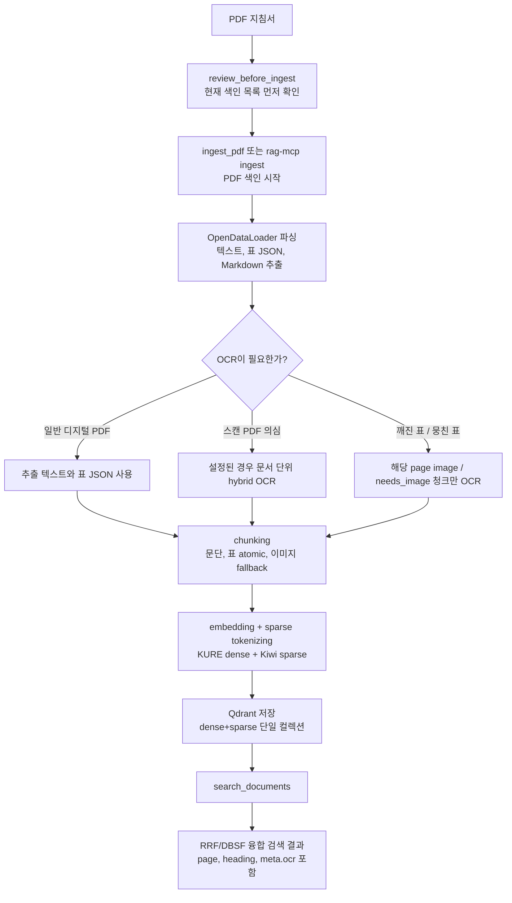

# RAG MCP

회계·예산 지침서 PDF를 로컬에서 색인하고 검색하는 MCP 서버입니다. 한국어 문장, 표, 과목코드, 금액 표현을 함께 다루도록 만들었고, Claude Desktop 같은 MCP 클라이언트에서 바로 검색 도구로 사용할 수 있습니다.

핵심은 **PDF를 한 번 색인해 두고, 질문할 때 dense+sparse 하이브리드 검색으로 근거 청크를 찾는 것**입니다. OCR은 기본값에서 전체 문서에 무조건 돌지 않고, 스캔 PDF이거나 깨진 표처럼 필요한 구간에서만 보강됩니다.

## 전체 워크플로



## 빠른 시작

### 1. 설치

Python 3.11과 uv를 기준으로 사용합니다. Python 3.13은 torch 계열 의존성 설치 리스크가 있어 피합니다.

```bash
git clone <repo-url> "RAG MCP"
cd "RAG MCP"
uv sync
```

설치가 정상인지 확인합니다.

```bash
uv run pytest -q
uv run rag-mcp status
```

처음 검색하거나 색인할 때 KURE-v1 임베딩 모델이 HuggingFace에서 자동 다운로드되고 `~/.cache/huggingface`에 캐시됩니다. 정부망/사내망 SSL 프록시 환경은 `truststore`가 Windows 인증서 저장소를 사용해 처리합니다.

### 2. OCR 선택 설치

OCR은 기본 사용에 필수는 아닙니다. 스캔 PDF나 깨진 표 구간을 보강하고 싶을 때만 설치하면 됩니다.

```bash
uv sync --extra ocr
winget install --id UB-Mannheim.TesseractOCR
uv run rag-mcp doctor
```

`doctor` 결과에서 `tesseract`, `kor`, `eng`가 정상으로 나오면 로컬 OCR을 사용할 수 있습니다. OCR이 설치되지 않아도 디지털 PDF의 일반 색인과 검색은 동작합니다.

### 3. PDF 색인

CLI로 직접 색인할 때는 MCP 서버가 꺼져 있어야 합니다. Qdrant local path 모드는 동시에 두 프로세스가 열면 파일락 충돌이 납니다.

```bash
uv run rag-mcp ingest "C:/path/to/예산편성_지침.pdf" --fiscal-year 2026
```

Claude Desktop 같은 MCP 클라이언트에서는 `ingest_pdf` 도구를 사용합니다. 이 도구는 큰 PDF에서도 타임아웃을 피하도록 백그라운드 job을 만들고 즉시 `job_id`를 반환합니다.

```text
1. review_before_ingest 로 기존 색인 목록 확인
2. ingest_pdf 로 새 PDF 색인 시작
3. ingest_status(job_id) 로 완료 여부 확인
4. 필요하면 delete_document 로 구버전 문서 삭제
```

### 4. 검색

```bash
uv run rag-mcp search "일상경비 한도" --top-k 5
uv run rag-mcp search "201-01 일반수용비" --fiscal-year 2026
```

검색 결과에는 청크 본문, 문서명, 페이지, 제목 경로, 표/이미지 여부, 사용자 메타데이터, OCR 적용 여부가 포함됩니다.

## Claude Desktop 연결

MCP 서버는 stdio transport로 실행됩니다. Claude Desktop 설정 파일 `%APPDATA%\Claude\claude_desktop_config.json`의 `mcpServers`에 아래 항목을 추가합니다.

경로는 이 PC 예시이므로 본인 환경의 `uv.exe`와 프로젝트 경로로 바꿔야 합니다.

```json
"rag-mcp": {
  "command": "C:\\Users\\Owner\\AppData\\Local\\Programs\\Python\\Python313\\Scripts\\uv.exe",
  "args": [
    "--directory",
    "C:\\Users\\Owner\\Desktop\\RAG MCP",
    "run",
    "rag-mcp",
    "serve"
  ]
}
```

설정 후 Claude Desktop을 완전히 종료했다가 다시 실행합니다. 자세한 연결 절차와 문제 해결은 [MCP_연동가이드.md](./MCP_연동가이드.md)를 참고하세요.

## 명령어 요약

| 목적 | 명령 |
|---|---|
| 설치 | `uv sync` |
| OCR 포함 설치 | `uv sync --extra ocr` |
| 테스트 | `uv run pytest -q` |
| 서버 실행 | `uv run rag-mcp serve` |
| 상태 확인 | `uv run rag-mcp status` |
| OCR 환경 진단 | `uv run rag-mcp doctor` |
| PDF 색인 | `uv run rag-mcp ingest "<PDF경로>" --fiscal-year 2026` |
| 검색 | `uv run rag-mcp search "<질문>" --top-k 5` |
| 검색 품질 평가 | `uv run rag-mcp eval eval/goldset.jsonl` |

## MCP 도구

| 도구 | 설명 |
|---|---|
| `search_documents` | dense+sparse 하이브리드 검색. `fiscal_year`, `meta.<키>` 필터 지원 |
| `review_before_ingest` | 새 PDF 색인 전 현재 색인 목록을 읽기 전용으로 확인 |
| `ingest_pdf` | PDF 색인을 백그라운드 job으로 시작하고 `job_id` 반환 |
| `ingest_status` | `job_id` 기준 색인 진행 상태 확인 |
| `list_documents` | 색인된 문서 목록, 연도, 청크 수, 상태 확인 |
| `get_chunk` | `chunk_id`로 원문 청크 단건 조회 |
| `delete_document` | 문서 삭제. `confirm=True`일 때만 실행 |
| `reindex_document` | 기존 parsed 결과 또는 원본 PDF 재파싱으로 재색인 |
| `collection_status` | 컬렉션, 문서 수, 차원, sparse 사용 여부 확인 |

## OCR 동작 방식

기본값은 `RAG_OCR=auto`입니다.

| 상황 | 동작 |
|---|---|
| 일반 디지털 PDF | OpenDataLoader가 추출한 텍스트와 표 JSON을 그대로 사용 |
| 스캔 PDF로 의심되는 문서 | `RAG_ODL_HYBRID`가 설정된 경우 문서 단위 hybrid OCR 후보 |
| 깨진 표, 뭉친 표, 이미지 fallback 청크 | 해당 페이지 이미지 또는 `needs_image=True` 청크만 Tesseract OCR |
| OCR을 쓰지 않으려는 경우 | `RAG_OCR=off` |
| 이미지 fallback 청크를 강제로 OCR하려는 경우 | `RAG_OCR=force` |

즉, “필요시 OCR”은 전체 PDF를 매번 OCR한다는 뜻이 아니라 **스캔 문서 또는 깨진 표처럼 텍스트 추출이 부족한 구간만 보강한다는 뜻**입니다. OCR 적용 여부와 skip 사유는 manifest와 검색 결과의 `meta.ocr`에 남습니다.

## 환경 변수

필요하면 `.env.example`을 `.env`로 복사해 조정합니다. 별도 API 키는 필요 없습니다.

| 변수 | 기본값 | 설명 |
|---|---|---|
| `RAG_DATA_DIR` | `./data` | 색인 산출물, Qdrant, manifest 저장 루트 |
| `RAG_QDRANT_MODE` | `local` | `local` 또는 `server` |
| `RAG_QDRANT_PATH` | `./data/qdrant` | local 모드 저장 경로 |
| `RAG_QDRANT_URL` | 없음 | server 모드 Qdrant URL |
| `RAG_EMBEDDING_MODEL` | `kure` | `kure` 또는 `bge_m3` |
| `RAG_RENDER_DPI` | `200` | 표/페이지 이미지 렌더 DPI |
| `RAG_OCR` | `auto` | `off`, `auto`, `force` |
| `RAG_OCR_LANG` | `kor+eng` | Tesseract OCR 언어 |
| `RAG_ODL_HYBRID` | `off` | 스캔 PDF 문서 단위 hybrid OCR 사용 시 설정 |

## 운영 주의사항

Qdrant local path 모드는 **단일 프로세스만** 접근해야 합니다.

- `uv run rag-mcp serve`가 떠 있으면 다른 터미널에서 `rag-mcp ingest`를 실행하지 마세요.
- Claude Desktop으로 연결한 상태에서는 MCP의 `ingest_pdf` 도구를 사용하세요.
- CLI 색인이 필요하면 MCP 서버를 먼저 종료한 뒤 실행하세요.
- `serve` 인스턴스도 하나만 실행하세요.

커밋하지 않는 재생성 산출물:

- `data/qdrant/`, `data/parsed/`, `data/manifests/`
- `*.pdf`, `*.png`
- `.cache/`, `.venv/`, `__pycache__/`, `.pytest_cache/`
- `.env`
